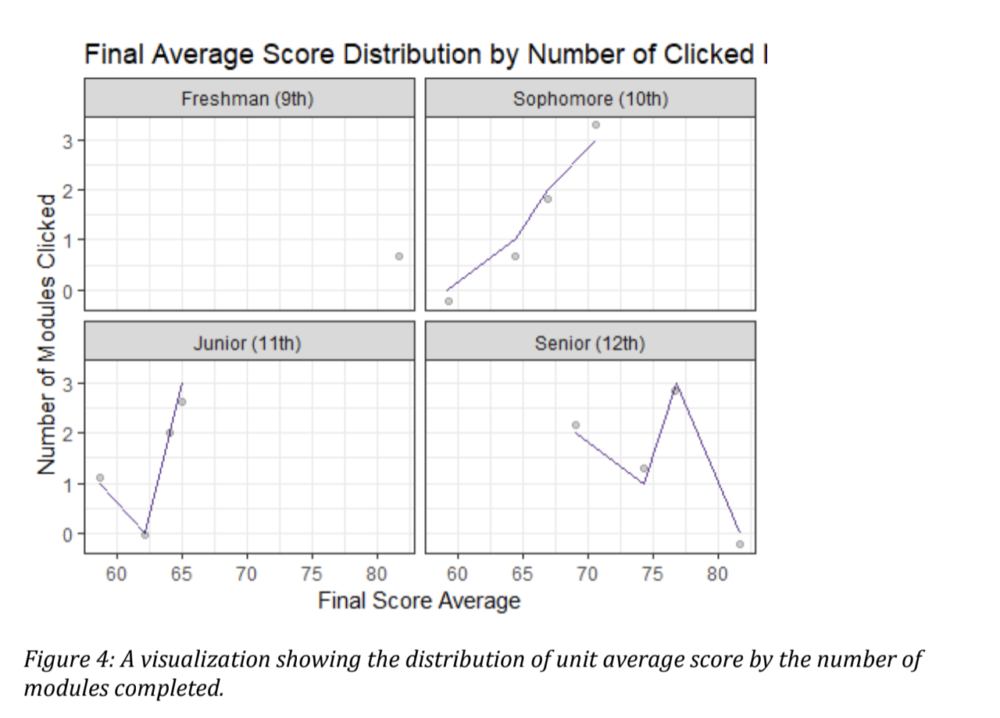
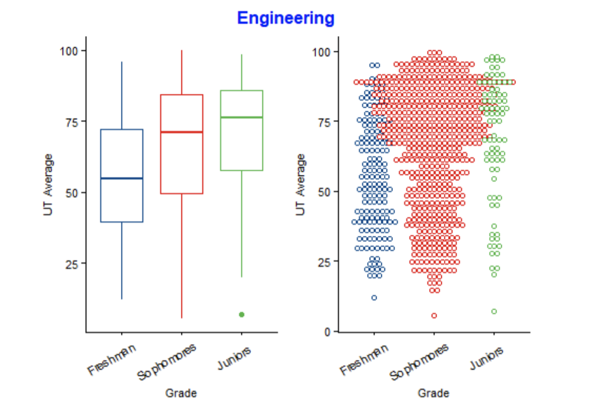
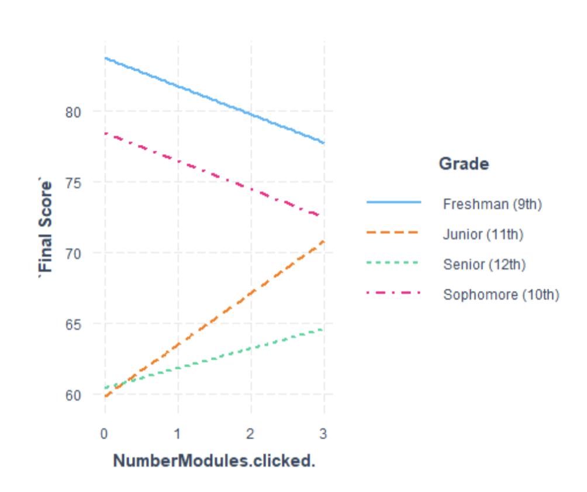

```{r setup, include=FALSE}
knitr::opts_chunk$set(echo = TRUE)
```

# Introduction

OnRamps is an innovative dual-enrollment program offered by the University of Texas at Austin. Students who enroll in OnRamps courses are enrolled in two classes, one that is taught by their high school teacher, and one that is taught by a university faculty. Assignments are graded by both the high school teacher and the faculty members at the University of Texas. Assignments recieve both a university grade that can be transferred for college credit, and a high school grade. 10,000 high school students participated in the program in the 2017-2018 academic year, and the majority were first-generation, low-income students, or students of color.

```{r, out.width=400, echo=F}

```


The goal of OnRamps is to introduce high school students to the rigors of college-level learning and to increase college persistence for high school students. Recent interventions involving growth mindset and bleonging measures have been implemented into the OnRamps curriculum through studies that occur before the unit and during the OnRamps process. In these interventions, students click through up to three modules refering to mindset and belonging intervention materials.

The interventions, designed by Schell and Martin, explore early warning signs related to academic risk, as well as existing socio-motivational and cognitive psychology analysis frameworks popular in the field of educaitonal psychology (Schell, Lukoff, Alvardo 2014). The components of the beginning of year assessment touch on psychological interventions work that target recursive processes at key junctures in student's academic careers, such as mindset, belonging, and purpose in learning (Yeager & Walton, 2011).

Additionally, students in the OnRamps program complete a beginning of the year survey that gathers data on student's perception and attitudes towards psychological concepts that will be included in the intervention design. The purpose of these questions is the guage student's attitudes and exposure to the ideas in the interventions. Researchers are particularly interesed in self-regulated learning, and how that characteristics relates to social-psychological interventions (Pintrich & DeGroot 1990). For that reason, the third aim of this study is to conduct an exploratory analysis on one of the open-ended questions in the BOCA, which is "What does being an independent learner mean to you"? Identifying trends in sentiments that students use to explain what "independence" as a learner may help to yield future insights into how students' perception of self-regulated learning affect their interaction with social-psychological assessments.

Lastly, researchers are interested in conducting an exploratory anaysis on student's intented college major and their performance in a pre-college course such as OnRamps. Research has suggested that students' intended majors affect their college expectations (Pike 2006). Data such as OnRamps, that includes an open-ended question where students can record their college major, as well as their performance on a dual-credit program, offers researchers a way to explore how intended major varies with performance in a dual-credit course.

In this paper, we examine the following questions

1. How did students engage with the intervention and was engagement related to subsequent course performance?
2. How does each grade level (freshman through senior) vary with each Unit 1, 2, 3, exam score?
3. What are the characteristics of student's response to the question "What does being an indpendent learner mean to you?" in the BOCA?
4. What are the characteristics of students intended majors and how their intended majors vary with exam performance and module completion?


## Methods

In order to analyze the data in this project, both visualization and inference statistical techniques will be used. The first two research questions will require linear regression techniques to answer. Since the second question revolves around a binary outcome, then logistic regression will be used.

The third and fourth research questions are exploratory research questions, and will be answered using visualization techniques and exploratory techniques of the data. The third research question requires sentiment analysis, or the process of computationally identifying opinions expressed in a piece of text in order to determine the participant's attitude towards a topic. This project will use the "bing" lexicon adapted from Bing Liu and collaborators. This lexicon categorizes words in a binary fashion into positive and negative categories. The fourth research question requires an exporatory analysis of visualizations to compare students who identified a certain major for the quesiton "What is your intended major"?

## Data

The data were collected from 3,484 high school students enrolled in the OnRamps Precalculus course for the 2017-2018 academic year. Students completed a survey before the course began that consisted of 14 items related to motivationa beliefs and leanring goals, and 14 items related to sense of belonging. The results of this survey were stored in the Beginning of Year Assessment data file (BOCA). Information regarding student's open-ended responses to the sentiment analysis quesiton, as well as student's open-ended responses to their intended major question, are stored in this file.

Second, after first exam scores were released, students were sent an email from the University course instructor with three versions, depending on the performance band of the students. Each email contained language to show students the communal aspect of students. Prior analysis of this data looked at how the efficacy of this interventions varied across each type of module (growth mindset, belonging, study habits). This analysis will look at how the efficacy of the intervention varied across "Click Rates", or how many Modules of the interventions students chose to engage with. The results of this data are stored in the "First Exam Intervention" file of FEI.

Lastly, students Unit 1, Unit 2, Unit 3, and Final Grades were collected throughout the semester. These grades are stored in the "Grades" file.

## Data preparation and analysis

The first step in our data preperation was to merge the files. OnRamps accumulated information from 3,484 high school students enrolled in the OnRamps Precalculus course for the 2017-2018 academic year. The files we merged together included the Beginning of Year Assessment (BOCA), First Exam Intervention (FEA), and the Unit Exam Grades (Grades). Merging these together created one data file, labelled "All Data" that was more managable for analysis.

After that, we selected the variables of interest, which were Unit 1-3 Exam Data, Student ID, Grade, School, the answer to the question "I like to be challenged in class", student's self-reported intended major, student's first and second exam intervention module choice, the click through rates for the modules, and the final UT grade given to students.

Next, we removed any missing data values from the data, and then created a new variable that identified whether or not the students recieved credit for the course. As noted in the original explanation, the purpose of the OnRamps course to give crexit for a UT course depends on the final UT given grade, that it is over a 70%. 

To continue, we created unified variables of the mean score of Unit 1 through 3 grades for each Grade level (freshman through seniors) that students were in.

Another way that we parsed that data was through the number of modules completed, giving us an opportunity to look at the differences in outcome scores based on the number of modules completed.

To continue with sentiment analysis at a later time, we identified the text components of the quesiton "What does being an independent learner mean to you?". This step required use of the tidytext package in R, which required that we munge the data into a specific structure in which the table has one-token-per-row, so that a meaningful unit of text, or a toke, can be analyzed and arranged. After organizing the data into the tidytext format, we gathered positive and negative sentiments from the "bing" lexicon, and joined them with the tidytext versions of our data, eventually using this newly joined data set to create visualizations of sentiments.

Finally, we identified specific majors that students self-reported on their BOCA surveys. We pulled out what students identified as their majors of choice. Since this was an exploratory step in the data analysis, hopefully for future questions to be asked, we were interested here in the numbers of students that listed a certain word in their major of choice. Thus, we created new data sets for students that listed popular majors as their intended major. Of course, the limitations of this approach are discussed extensively in the limitations section. 


```{r, out.width=400, echo=F}

```

```{r, out.width=400, echo=F}

```

```{r, out.width=400, echo=F}

```


# Markdown Code
Merge the three files (BOCA, Grades, and FEI) together into one file using the merge function. Rename this new data set as "All Data". Use the dimensions function to check if the data from each merged correctly.
```{r eval=FALSE, message=FALSE, include=TRUE, echo=TRUE}

#Make grade a factor, so that it goes in order of freshman ,sohpomore, junir, senio
#The number of modules completed graph, treat it as a factor if it has colors
#Treat the number of modules as a factor so that the boxplots will show up next to eachother
#a new variable that has the same name and an udnerscore fa
#Put the narrative of each figure below each figure

library(tidyverse)
BOCA <- read_csv("../../../../Data/BOCA.csv")
Grades1 <- read.csv("../../../../Data/ExamGrades.csv")
Grades <- Grades1 %>%
  rename( "Student_ID" = "?..Student_ID")
FEI <- read.csv("../../../../Data/FirstExamIntervention.csv")
data <- merge(BOCA, FEI, by="Student_ID", all=T)
AllData <- merge(data, Grades, by="Student_ID", all=T)
dim(BOCA)
dim(Grades)
dim(FEI)
dim(AllData)
```
Choose the variables of interest that will be used for the analysis. Create a new data set, titled "All_Data" that includes only these variables (Student ID, School, Grade, "I like to be challenged in my classes", Grades for each Unit Exam, Number of Modules clicked, and the overall UT Average). Then, create a new variable to identify if the student recieved credit or not for the course (a score of 70%). Remove any missing values from the data. Filter out the NAs from each part of the dataset.
```{r eval=FALSE, message=FALSE, include=TRUE, echo=TRUE}
library(tidyverse)
All_Data <- AllData %>%
  select(Student_ID, School, Grade, `I like to be challenged in my classes`, Unit_1_Exam, Unit_2_Exam, Unit_3_Exam_, NumberModules.clicked., UT_Average) %>%
  mutate(credit = ifelse(UT_Average > 70, "Credit", "No Credit"),
         Grade = as.factor(Grade)) %>%
  rename("Credit Outcome" = credit) %>%
  filter(!is.na(Grade),
         !is.na(Unit_1_Exam),
         !is.na(Unit_2_Exam),
         !is.na(Unit_3_Exam_),
         !is.na(NumberModules.clicked.))
```
Create a new dataset, titled "All_Data_grouped" that groups by Grade, and summarises the average exam scores (for Units 1-3) and the standard deviation of each exam score (for Units 1-3). Recode the Grade variable as factors so that the data appears in order of Freshman, Sophomore, Juniors, Seniors.
```{r eval=FALSE, message=FALSE, include=TRUE, echo=TRUE}

All_Data_grouped <- All_Data %>%
  select(Grade, Unit_1_Exam, Unit_2_Exam, Unit_3_Exam_, NumberModules.clicked.) %>%
  group_by(Grade) %>%
    summarise(N= n(),
            "Average Score Unit 1" = mean(Unit_1_Exam),
            sd_Unit1 = sd(Unit_1_Exam),
            "Average Score Unit 2" = mean(Unit_2_Exam),
            sd_Unit2 = sd(Unit_2_Exam),
            "Average Score Unit 3"= mean(Unit_3_Exam_),
            sd_Unit3 = sd(Unit_3_Exam_))
is.factor(All_Data_grouped$Grade)

levels(All_Data_grouped$Grade) <- c("Freshman (9th)", "Sophomore (10th)", "Junior (11th)", "Senior (12th)")
All_Data_grouped

```
Create a new dataset, titled "All_Data_final" that groups by both Grade and the number of modules clicked, summarises the average Final course grade for each group, as well as the number of students in each Number of Modules Clicked group.
```{r eval=FALSE, message=FALSE, include=TRUE, echo=TRUE}

All_Data_final <- All_Data %>%
  select(Grade, Unit_1_Exam, Unit_2_Exam, Unit_3_Exam_, UT_Average, NumberModules.clicked.) %>%
  group_by(Grade, NumberModules.clicked.) %>%
  mutate(final_average = mean(UT_Average)) %>%
  group_by(final_average, Grade, NumberModules.clicked.) %>%
    summarise(N= n())
All_Data_final
```
Create a new dataset, titled "All_Data_Exams" that groups by the Number of Modules clicked, and includes each Unit 1,2,and 3 Exam grade for every participant.
```{r eval=FALSE, message=FALSE, include=TRUE, echo=TRUE}

All_Data_Exams <- All_Data %>%
  select(Grade, Unit_1_Exam, Unit_2_Exam, Unit_3_Exam_, NumberModules.clicked.) %>%
  mutate(NumberModules.clicked. = as.factor(All_Data$NumberModules.clicked.)) %>%
  group_by( NumberModules.clicked.) %>%
  arrange(NumberModules.clicked.) %>%
  gather(key = "Unit", value = "Score", Unit_1_Exam, Unit_2_Exam, Unit_3_Exam_)
All_Data_Exams
```
Create a new data set, titled "All_Data_Clicked" that groups information by the Number of Modules clicked and summarizes the average Unit 1,2,3 and Final Score for each group.
```{r eval=FALSE, message=FALSE, include=TRUE, echo=TRUE}
All_Data_Clicked <- All_Data %>%
  select(Grade, Unit_1_Exam, Unit_2_Exam, Unit_3_Exam_, NumberModules.clicked., UT_Average) %>%
  group_by(NumberModules.clicked., Grade) %>%
    summarise(N= n(),
            "Average Score Unit 1" = mean(Unit_1_Exam),
            "Average Score Unit 2" = mean(Unit_2_Exam),
            "Average Score Unit 3" = mean(Unit_3_Exam_),
            "Final Score" = mean(UT_Average))
All_Data_Clicked
```
Create a new TidyText Dataset that has only the variables of interest to the question "What does being an independent learner mean to you?" Create a vector from that question, turning the responses into a tibble, and then tokenizing each response to that one word appeared in each row of the frame. After that, remove the stop words from the dataset. These are the words like "and", "or", etc. that are included in the "Stop Words" dataset included in the package. Using the "count" funciton, count the amount of times that a given word appeared. Due to the small amount of freshman in the dataset, and the lack of unique word responses, do not include freshman in the comparison of sentiments. Then, write a function that picks out the top ten positive and negative sentiments from a data set, and ran this on the seniors, juniors, and sophomore datasets.    
```{r eval=FALSE, message=FALSE, include=TRUE, echo=TRUE}
#Create one data frame with the variables of interest
library(stringr)
library(tidytext)
Tidy_Text_Data <- AllData %>%
  select(Student_ID, School, Grade, Unit_1_Exam, Unit_2_Exam, Unit_3_Exam_, UT_Average, `What does being an independent learner mean to you`) %>%
  filter(!is.na(Unit_1_Exam),
         !is.na(Unit_2_Exam),
         !is.na(Unit_3_Exam_))
#Convert the data frame into a vector, then a tibble, then tokenize the responses so that each word is in one spot
data <- Tidy_Text_Data %>%
  select(txt = `What does being an independent learner mean to you`, Grade, Student_ID) %>%
  mutate(txt = as.vector(txt))
data <- data %>%
  unnest_tokens(word, txt)
#Remove the stop words
library(tidytext)
data(stop_words)
stop_words
data <- data %>%
  anti_join(stop_words)
#Group the  data by grade and create a new dataset for each grade (freshman not included)
data_grade <- data %>%
  group_by(Grade, word) %>%
  count(word, sort = TRUE) %>%
  group_by(Grade) %>%
  filter(!is.na(word))
juniors <- data_grade %>%
  filter(Grade == "Junior (11th)") %>%
  slice(1:10)
seniors <- data_grade %>%
  filter(Grade == "Senior (12th)") %>%
  slice(1:10)
sophomores <- data_grade %>%
  filter(Grade == "Sophomore (10th)") %>%
  top_n(10)
newdata <- rbind(seniors, juniors,sophomores)
newdata
#Then, do a sentiment analysis, using the bing lexicon
library(tidytext)
get_sentiments("bing")
#Create a function that will join the negative and positive sentiments into a data frame for each grade level
function_words <- function(grade, data) {
  grade_level <- data %>%
  filter(Grade == grade)
data_grade <- grade_level %>%
  select(word, n)
word_counts <- data_grade %>%
  inner_join(get_sentiments("bing"))
word_counts_positive <- 
  word_counts %>%
filter(sentiment == "positive") %>%
  slice(1:10)
word_counts_negative <-
  word_counts %>%
  filter(sentiment == "negative") %>%
  slice(1:10)
words_grade <- rbind(word_counts_negative, word_counts_positive)
return(words_grade)
}
#Run the function on the senior, junior, and sophomore dataset
sophomore_sentiments <- function_words("Sophomore (10th)", data_grade)
sophomore_sentiments
junior_sentiments <- function_words("Junior (11th)", data_grade)
junior_sentiments
seniors_sentiments <- function_words("Senior (12th)", data_grade)
seniors_sentiments
```
Identify students who listed a certain subject within their majors. Create a function to pull out students who listed this major in the subject and create a new data frame for each of these majors.
```{r eval=FALSE, message=FALSE, include=TRUE, echo=TRUE}
library(stringr)
Intended_Study <- AllData %>%
  select(Student_ID, School, Grade, Unit_1_Exam, Unit_2_Exam, Unit_3_Exam_, UT_Average, `My intended area of study is`) %>%
  filter(!is.na(Unit_1_Exam),
         !is.na(Unit_2_Exam),
         !is.na(Unit_3_Exam_))
major_identifier <- function(major, data) {
  clean_major <- data %>%
    filter(str_detect(`My intended area of study is`, major))
  return(clean_major)
}

biodat <- major_identifier("Biology", Intended_Study)
chemdat <- major_identifier("Chemistry", Intended_Study)
educationdat <- major_identifier("Education", Intended_Study)
engineeringdat <- major_identifier("Engineering", Intended_Study)
statisticsdat<- major_identifier("Statistics", Intended_Study)
artdat <- major_identifier("Art", Intended_Study)
englishdat <- major_identifier("English", Intended_Study)
```


# Visualizations

```{r eval=FALSE, message=FALSE, include=TRUE, echo=TRUE}
levels(All_Data$Grade) <- c("Freshman (9th)", "Sophomore (10th)", "Junior (11th)", "Senior (12th)")
credit_graph <- ggplot(data = All_Data) +
  aes(x = `Credit Outcome`, fill = `Credit Outcome`) +
  geom_bar() +
  scale_fill_brewer(palette = "Set2") +
  labs(title = "Distribution of Credit/No Credit for Each Grade",
       x = "Grade Type",
       y = "Number of Students") +
  theme_bw() +
  facet_wrap(vars(Grade)) +
  coord_flip()
credit_graph
```

Figure 1 shows the distribution of students recieving or not recieving credit for the course from their UT Austin Instructor. As mentioned in the introduction, students who receive over a 70% on the final grade recieve course credit for their college work. From a visual inspection of the graph, one can see that the Junior class had the greatest numbers of participation, follows by the seniors, sophomores, juniors, and freshman. The graph also revals that for the Junior and Senior classes, more students did not recieve credit than those who did receive credit. However, for the Sophomore and Freshman classes, more students received credit than did not recieve credit.

```{r eval=FALSE, message=FALSE, include=TRUE, echo=TRUE}
All_Data_grouped_1 <- All_Data %>%
  select(Grade, Unit_1_Exam, Unit_2_Exam, Unit_3_Exam_, NumberModules.clicked.) %>%
  group_by(Grade) %>%
    summarise(N= n(),
            "Average Score Unit 1" = mean(Unit_1_Exam),
            sd_Unit1 = sd(Unit_1_Exam),
            "Average Score Unit 2" = mean(Unit_2_Exam),
            sd_Unit2 = sd(Unit_2_Exam),
            "Average Score Unit 3"= mean(Unit_3_Exam_),
            sd_Unit3 = sd(Unit_3_Exam_))
grouped_graph <- All_Data_grouped_1 %>%
  gather(key = "Unit", value = "Score", `Average Score Unit 1`, `Average Score Unit 2`, `Average Score Unit 3`)
Graph <- ggplot(data = grouped_graph) +
  aes(x = Unit, weight = Score, fill = Grade) +
  geom_bar(alpha = 0.7) +
  theme_bw() +
   facet_wrap(vars(Grade)) +
  labs(title = "Average Unit 1-3 Exam Scores Separated by Grade Level",
       x = "Exam",
       y = "Score")
Graph
```

Figure 2 shows barplots for Unit 1, 2, and 3 exam scores seperated by Grades of the students. This figure demonstrates visually that the average scores for Unit 1 exam were highest for each grade level, and that the Unit exam scores for sophomores, seniors, and juniors declines over the course of the semester. The freshmen group, on the other hand increased their Unit 3 exam score after the Unit 2 exam. Also noteworthy is the comparison of scores across grade levels, with freshmen and seniors achieving the highest grades on each unit exam.

```{r eval=FALSE, message=FALSE, include=TRUE, echo=TRUE}
grouped_graph2 <- All_Data_final %>%
  gather(key = "Grades", value = "Final Average Score", final_average)
levels(grouped_graph2$Grade) <- c("Freshman (9th)", "Sophomore (10th)", "Junior (11th)", "Senior (12th)")
graph2 <- ggplot(data = grouped_graph2) +
  aes(x = Grade, y = `Final Average Score`, fill = Grade) +
   geom_violin(alpha = .5) +
  geom_boxplot(alpha = .5, width = 0.3) +
   labs(title = "Final Average Score for Each Grade" ,x = "High School Grade", y = "Final Average Score") +
  theme_minimal() +
  guides(fill = FALSE)
graph2
```

Figure 3 shows boxplots of the final UT average score for each grade. Freshmen and seniors have the highest median average score while juniors have the lowest amount. 

```{r eval=FALSE, message=FALSE, include=TRUE, echo=TRUE}

Modules_plot_1 <- ggplot(All_Data_Exams, aes(x = NumberModules.clicked., y = Score)) + 
  geom_boxplot(fill = "#dadaeb") +
  labs(x = "Number of Modules Clicked", y = "Unit Score")+
  theme_minimal() +
  labs(title = "Unit Average Scores Distribution by Number of Clicked Modules")
Modules_plot_1

levels(All_Data_final$Grade) <- c("Freshman (9th)", "Sophomore (10th)", "Junior (11th)", "Senior (12th)")
Modules_plot_2 <- ggplot(data = All_Data_final) +
  aes(x = final_average, y = NumberModules.clicked.) +
  geom_line(color = "#6a3d9a") +
  labs(title = "Final Average Score Distribution by Number of Clicked Modules for Each Grade",
    x = "Final Score Average",
    y = "Number of Modules Clicked") +
  geom_jitter(alpha = .2) +
  #geom_smooth() +
  theme_bw() +
  facet_wrap(vars(Grade))
Modules_plot_2
```

Figures 4. The first figure shows that the median average unit score increases by an increase in number of modules clicked by students. The second figure compares the final average scores of students for each grade level based on the number of modules completed. These graphs demonstrates that as students complete more modules, in general the Final Average score increases (This trend is not true for seniors). These are later referenced in the statistical regression test.
 
```{r eval=FALSE, message=FALSE, include=TRUE, echo=TRUE}
data_count <- data %>%
  count(word, sort = TRUE) %>%
  filter(!is.na(word))
data_count_graph <- data_count %>%
  mutate(word = reorder(word, n)) %>%
  top_n(10)
graph <- ggplot(data = data_count_graph) +
  aes(x = word, weight = n) +
  geom_bar(fill = "#35b779") +
  theme_update() +
  coord_flip() +
  ggtitle("Frequent Words in Response to Independent Learner Question") +
  ylab("Word Count") +
  xlab("Word")
graph

#A visualization of the top positive and negative words for each grade level

sophomore_graph <- sophomore_sentiments %>%
  group_by(sentiment) %>%
  top_n(10) %>%
  ungroup() %>%
  mutate(word = reorder(word, n)) %>%
  ggplot(aes(word, n, fill = sentiment)) +
  geom_col(show.legend = FALSE) +
  facet_wrap(~sentiment, scales = "free_y") +
  coord_flip() +
  ggtitle("Sophomore's Most Positive and Negative Words") +
  ylab("Count") +
  xlab("Word")

junior_graph <- junior_sentiments %>%
  group_by(sentiment) %>%
  top_n(10) %>%
  ungroup() %>%
  mutate(word = reorder(word, n)) %>%
  ggplot(aes(word, n, fill = sentiment)) +
  geom_col(show.legend = FALSE) +
  facet_wrap(~sentiment, scales = "free_y") +
  coord_flip() +
  ggtitle("Junior's Most Positive and Negative Words") +
  ylab("Count") +
  xlab("Word")

senior_graph <- seniors_sentiments %>%
  group_by(sentiment) %>%
  top_n(10) %>%
  ungroup() %>%
  mutate(word = reorder(word, n)) %>%
  ggplot(aes(word, n, fill = sentiment)) +
  geom_col(show.legend = FALSE) +
  facet_wrap(~sentiment, scales = "free_y") +
  coord_flip() +
  ggtitle("Seniors's Most Positive and Negative Words") +
  ylab("Count") +
  xlab("Word")

sophomore_graph
junior_graph
senior_graph

            
```

Figures 5 demonstrate an exploratory analysis of the sentiment analysis conducted. The graph presents the most commonly used words all students used to answer the question "What does being an independent learner mean to you?". The first graph shows the most frequent words in response to the question, for all students enrolled in the OnRamps course. The second graph parses out the frequency of these words by grade. The next three graphs use the sentiment data set to pull out the top 10 positive and top 10 negative words used by each Grade level of students.

```{r eval=FALSE, message=FALSE, include=TRUE, echo=TRUE}
#Create a function that takes in the major, and the data, and returns a graph of the distribution of Average UT Exam scores
graphlabels <- c("Freshman", "Sophomores", "Juniors", "Seniors")
library(ggpubr)
function_graph <- function(major, data) {
  box <- ggboxplot(data, x= "Grade", y = "UT_Average", color = "Grade", palette = "lancet") +
  theme(text = element_text(size = 8)) +
  labs( y = "UT Average") +
  scale_x_discrete(labels = graphlabels) +
    theme(axis.text.x = element_text(color = "black", size = 8, angle = 30, vjust = .8, hjust = 0.8)) +
  theme(legend.position = "none")
dot <- ggdotplot(data, x= "Grade", y = "UT_Average", color =  "Grade", palette = "lancet", binwidth = 2, dotsize = 0.9) +
  theme(text = element_text(size = 8)) +
  labs( y = "UT Average") +
   scale_x_discrete(labels = graphlabels) +
    theme(axis.text.x = element_text(color = "black", size = 8, angle = 30, vjust = .8, hjust = 0.8)) +
  theme(legend.position = "none")
figure_function <- ggarrange(box, dot)
figure_function <- figure_function %>%
  annotate_figure(figure_function,
                  top = text_grob(major, color = "blue", face = "bold"))
}
#Run the function in different major's data
graph_bio <- function_graph("Biology", biodat)
graph_bio
graph_chem <- function_graph("Chemistry", chemdat)
graph_chem
graph_education <- function_graph("Education", educationdat)
graph_education
graph_engineering <- function_graph("Engineering", engineeringdat)
graph_engineering
graph_statistics <- function_graph("Statistics", statisticsdat)
graph_statistics
graph_art <- function_graph("Art", artdat)
graph_art
graph_english <- function_graph("English", englishdat)
graph_english
```

Figures 6 used a function to create two graphs for each intended major of students. The graphs show the distribution of exam scores for studets who identified one of the chosen words in their description of their intendend major for college.

#Statistical Analysis
First regression is a regression of engagement related to overal students Unit 1,2,3, and End of Year Exam performance.
```{r eval=FALSE, message=FALSE, include=TRUE, echo=TRUE}

regression1 <- lm(`Average Score Unit 1`  ~ NumberModules.clicked.,data = All_Data_Clicked)
regression2 <- lm(`Average Score Unit 2` ~ NumberModules.clicked., data = All_Data_Clicked)
regression3 <- lm(`Average Score Unit 3` ~ NumberModules.clicked., data = All_Data_Clicked)
regression4 <- lm(`Final Score` ~ NumberModules.clicked., data = All_Data_Clicked)

summary(regression1)
summary(regression2)
summary(regression3)
summary(regression4)

```
The regression models give us information on whether number of modules that were clicked by students is a predictor of average unite scores and average final scores for students. In all regression models above, we implemented an alpha value of 0.05 that gives us the two-tailed p-value of the slope of the regression model. 
In the first regression model, the p-value: 0.118 is not significant which means that the number of modules clicked is not a significant predictor of the Unit 1 aveareg score for students. On the other hand, the p-values of 0.023, 0.008, and 0.001 with positive slopes for Unit 2, Unit 3, and final average score respectively shows that the number of modules clicked by students is a significant positive predictor of their exam performance.

```{r eval=FALSE, message=FALSE, include=TRUE, echo=TRUE}
regression5 <- lm( `Final Score`~ NumberModules.clicked. + Grade + NumberModules.clicked.: Grade, data = All_Data_Clicked)

summary(regression5)
# The following code shows the interaction plot between the number of modules clicked and grade level
library(interactions)
interact_plot(regression5, pred = NumberModules.clicked., modx = Grade)
```

The regression model above investigates whether the relationship between average final score and number of modules clicked is moderated by the school grade level. By looking at the summary of the regression model presented above, only for sophomores the relationship between the average final score and number of modules clicked is significantly moderated by the grade level (B = 5.661, t(6) = 2.492, p <.05).

Moreover, the interaction plot shows the trend in final average score change due to the number of modules clicked for each grade level. This plot shows the interaction between grade levels and number of modules clicked clearly. 

